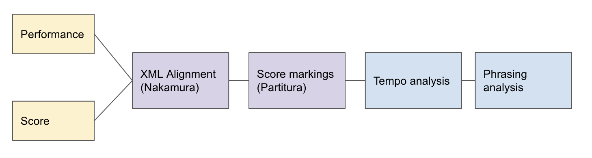

# Expression Style Profile

Expression Style Profile (ESP) is a set of extracted attributes from symbolic piano performance files. From an alignment with the score, the attributes analyzes expressive details from hands asynchrony to rubato patterns. All attributes are in piece-level. 

Usage:
```
from ESP import ExpressionStyleProfile

esp = ExpressionStyleProfile("examples/mozart_match.csv", "examples/mozart.xml")
esp.get_attributes()
print(esp)

"""
sp_async_delta: 0.0134
sp_async_cor_onset: 0.443
sp_async_cor_vel: 0.5233
sp_async_parts: 0
st_tempo_std: 27.6051
sp_duration_percentage: 0.8588
sp_key_overlap_ratio: -0.2018
sp_kor_legato: -0.1129
sp_kor_staccato: -0.6401
sp_kor_repeated: -0.6079
sp_dynamics_agreement: 1.0
sp_dynamics_consistency_std: 11.1639
sp_phrasing_rubato_w: 0.5803
sp_phrasing_rubato_q: 5.1833
"""

```

#### Aligned match file


An analysis workflow is as follows: 



## Expression categories 

### Asynchrony 

For each piece, all same-onset group with more than 3 events are considered, and their performed onset asynchrony are studied with the following attributes.
```sp_asynchrony_delta```: The average amount of asynchrony time (in seconds) of the same-onset group played in the piece.

```sp_asynchrony_cor_pitch```: The Pearson's correlation of the notes' onsets with their pitch. 

```sp_asynchrony_cor_vel```: The Pearson's correlation of the notes' onsets with their velocity. See [this paper](https://asa.scitation.org/doi/10.1121/1.1376133). 

```sp_asynchrony_cor_voice```: The Pearson's correlation of the notes' onsets with their voice rank (parsed from score, might not be accurate).


### Articulation
```sp_duration_percentage```: The amount of indicated duration being performed. 

```sp_key_overlap_ratio```: The Key Overlap Ratio (KOR), referenced from [this work](https://www.researchgate.net/publication/233013901_Articulation_Strategies_in_Expressive_Piano_Performance_Analysis_of_Legato_Staccato_and_Repeated_Notes_in_Performances_of_the_Andante_Movement_of_Mozart's_Sonata_in_G_Major_K_545), is defined as the ratio between key overlap time and inter onset interval. 

```sp_kor_legato```: The KOR for all notes with legato marking. Averaged across all voices. 

```sp_kor_staccato```: The KOR for all notes with staccato marking. Averaged across all voices. 

```sp_kor_repeated_notes```: The KOR for all repeated notes that's not the last one in the sequence. Averaged across all voices. 


### Tempo 
By aligning the beat onto performance, the IBI (inter-beat-interval) can be computed in a local level where we have on-beat events.  

```sp_tempo_std```: std of all local tempo, characterizes the overall tempo fluctuation in a performance. Note this is strongly correlated with composition itself, improvement is required regards to the 

### Dynamics 
We parsed dynamics markings (*pp, p, mp, mf, f, ff*) from the score using the [partitura](https://partitura.readthedocs.io/en/latest/index.html) package, and align them with the performed events. The attributes are inspired from this [Dynamics and relativity paper](https://www.tandfonline.com/doi/abs/10.1080/09298215.2018.1486430?journalCode=nnmr20), and we also take a 3-beat window in computation same as the paper.  

```sp_dynamics_agreement```: The amount of dynamics agreement with the ordinal *pp < p < mp < mf < f < ff*. Averaged across all pair of consecutive markings. 

```sp_dynamics_consistency_std```: How consistent each dyanmics class is throughout the piece. Final value is averaged across all classes. 

TODO: incorporate gradual dynamics marking such as *crescendo*. 

### Phrasing 

Rubato w and q: inspired from [this paper](https://www.researchgate.net/publication/220723460_Evidence_for_Pianist-specific_Rubato_Style_in_Chopin_Nocturnes), where a kinematic model ($v(x) = (1 + (w^q - 1)x^{1/q})$) is used to characterize the rubato at the phrase end (where usually fits to *ritardandi*). 

```sp_phrasing_rubato_w```: the final tempo from the kinematic model. 

```sp_phrasing_rubato_q```: account for variation of curvature from the kinematic model.

### Textural 

## Stats

#### ATEPP 

|  |  |
| ----------- | ----------- |
| #. total pieces                           |  11672 |
| #. pieces with xml score                  |  6838  |
| #. pieces aligned                         |  4138  |
| #. valid alignment (<50% err)             |  3752  |
| #. pieces with scores parsed by partitura |        |
| #. pieces with dynamics marking           |  3434  |
| #. pieces with all attributes computed    |  1201  |

#### ASAP

|  |  |
| ----------- | ----------- |
| #. total pieces                           |   |
| #. pieces with xml score                  |    |
| #. pieces aligned                         |    |
| #. valid alignment (<50% err)             |    |
| #. pieces with scores parsed by partitura |        |
| #. pieces with dynamics marking           |    |
| #. pieces with all attributes computed    |    |


## Significance and analysis

#### ATEPP: Performer significance: One-way ANOVA
|  ```sp_asynchrony_delta```| ```sp_asynchrony_cor_pitch``` | ```sp_asynchrony_cor_vel``` | ```sp_articulation_ratio``` | ```sp_dynamics_agreement``` | ```sp_dynamics_consistency_std```
| ----------- | ----------- | ----------- | ----------- | ----------- | ----------- |
| 0.028   |  3e-10 | 4.39e-8 |  | 0.401 | 0.0003 |  


#### ATEPP: Classification F1: Perfomer vs Composer

Data support: ~1200 (debugging nan values)

| attributes | DTree | GradientBoosting | MLP | 
| ----------- | ----------- | ----------- | ----------- |
|  async  | 0.25 (0.1)  | 0.16 (0.07) | 0.27 (0.11) |
|  async+dynamics+articulation  | 0.38 (0.19)  | 0.41 (0.09) | 0.29 (0.08) |

#### Significance analysis of attributes
